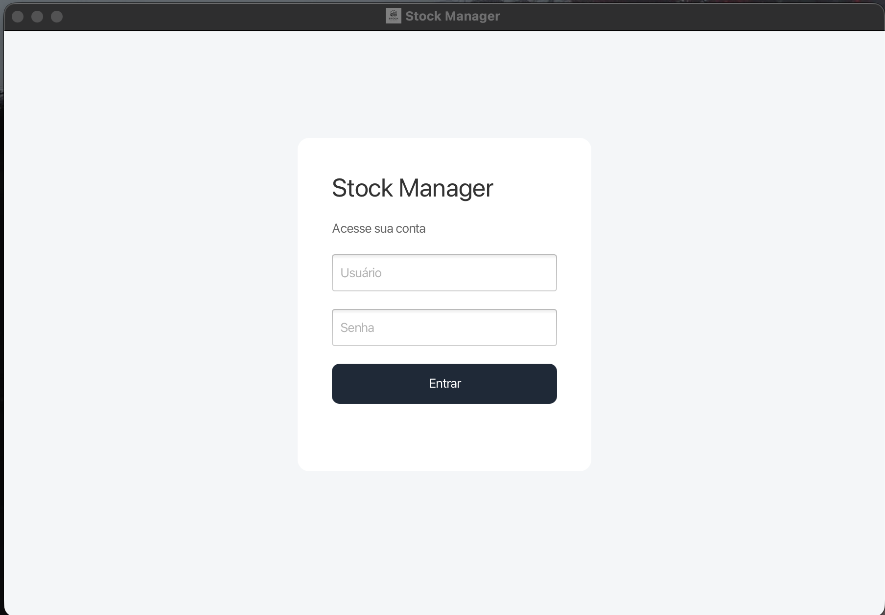
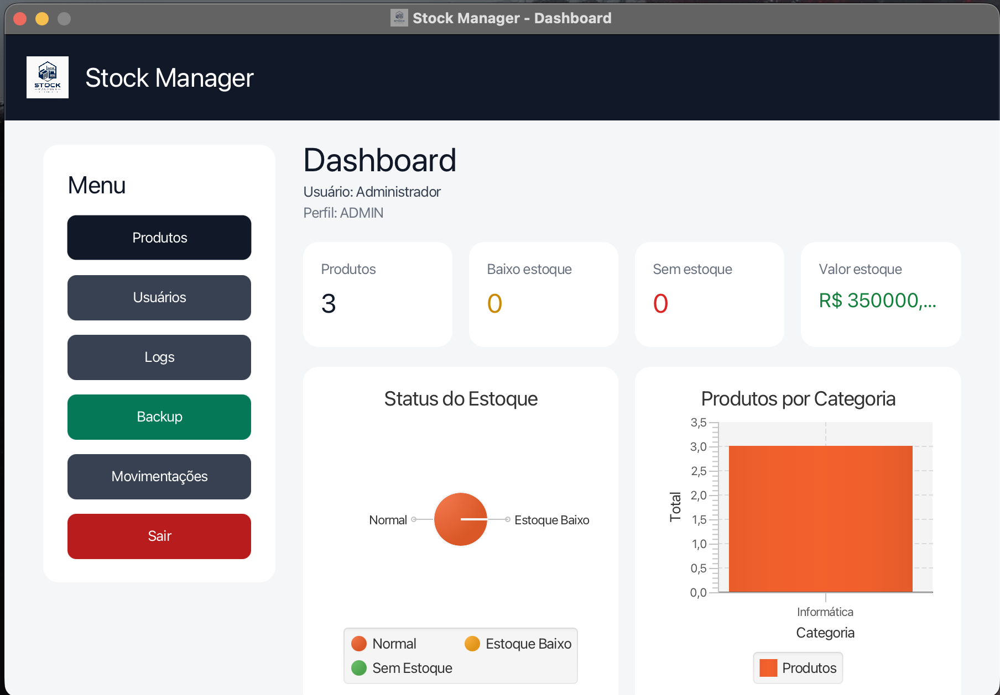
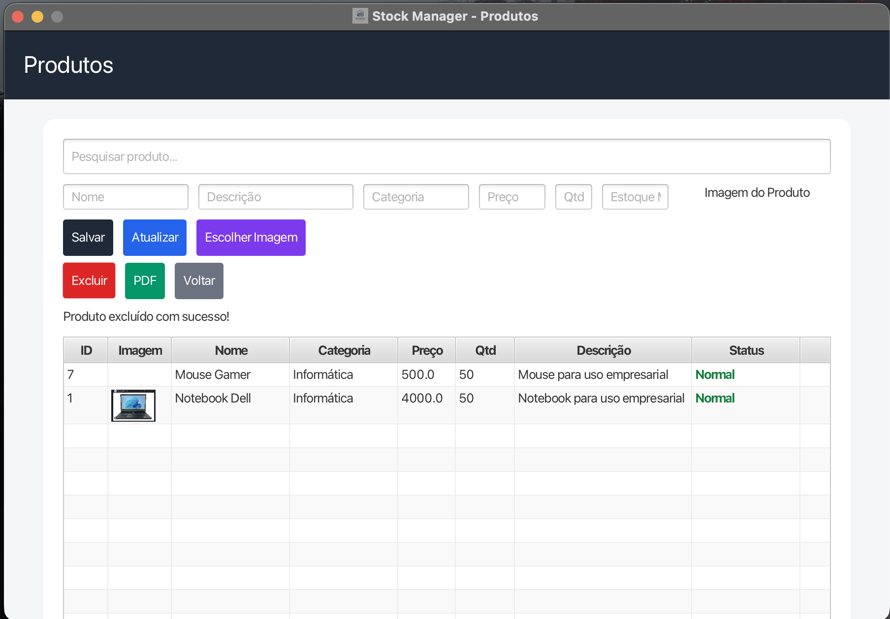
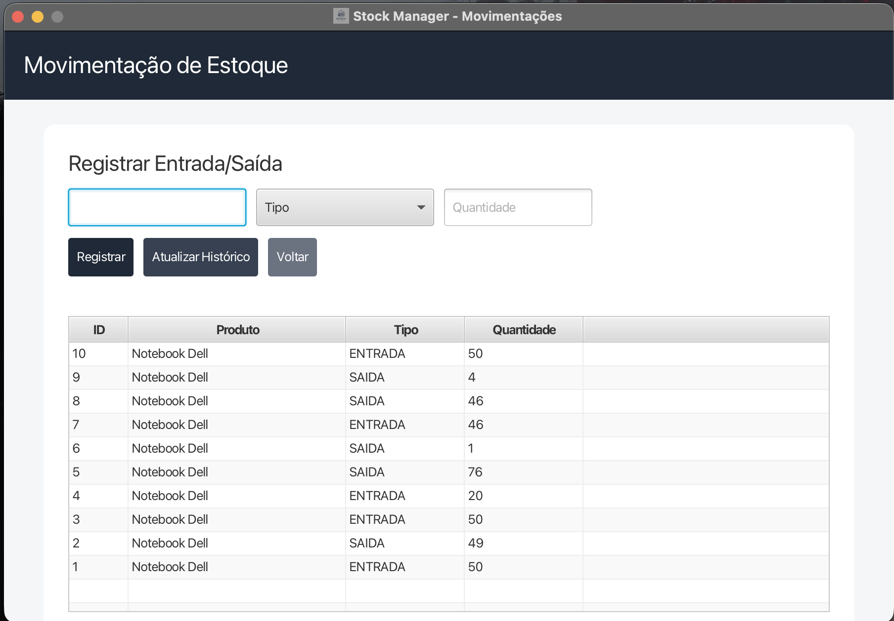
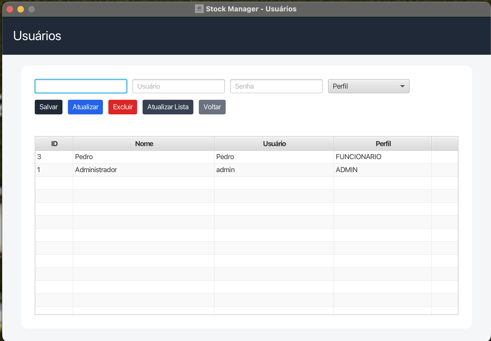
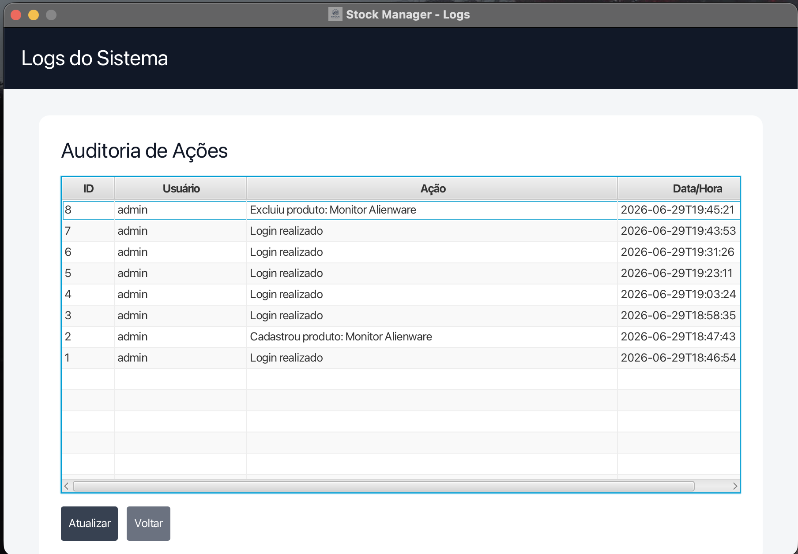

# 📦 Stock Manager


Sistema desktop para gerenciamento de estoque desenvolvido em JavaFX como projeto de estudo, aplicando autenticação de usuários, controle de permissões, gerenciamento de produtos e movimentações de estoque.

## Tecnologias

* Java 21
* JavaFX
* Maven
* MySQL
* JDBC
* BCrypt
* iText PDF

## Funcionalidades

* Login com autenticação utilizando BCrypt
* Controle de acesso por perfil (Administrador e Funcionário)
* Dashboard com indicadores e gráficos
* Cadastro, edição e exclusão de produtos
* Upload de imagens dos produtos
* Controle de usuários
* Registro de entradas e saídas de estoque
* Histórico de movimentações
* Auditoria de ações (logs)
* Exportação de produtos em PDF
* Backup do banco de dados
* Splash Screen na inicialização

---

## Telas

### Login



### Dashboard



### Produtos



### Movimentações



### Usuários



### Logs



---

## Estrutura do projeto

```text
src
├── controller
├── dao
├── database
├── model
├── security
├── util
└── resources
```

---

## Como executar

Clone o projeto:

```bash
git clone https://github.com/SEU-USUARIO/javafx-stock-manager.git
```

Entre na pasta:

```bash
cd javafx-stock-manager
```

Execute a aplicação:

```bash
./mvnw javafx:run
```

---

## Banco de dados

Crie um banco chamado:

```text
stock_manager
```

Configure as credenciais da conexão em:

```text
database/Conexao.java
```

---

## Objetivo

Este projeto foi desenvolvido para aprofundar conhecimentos em desenvolvimento desktop utilizando Java, JavaFX e MySQL, aplicando conceitos como autenticação, arquitetura em camadas, persistência de dados, controle de acesso e organização de código.

---

## Autor

**Kayque Miguel da Fonseca Reis Galvão**

GitHub: https://github.com/kayquemigueldev
